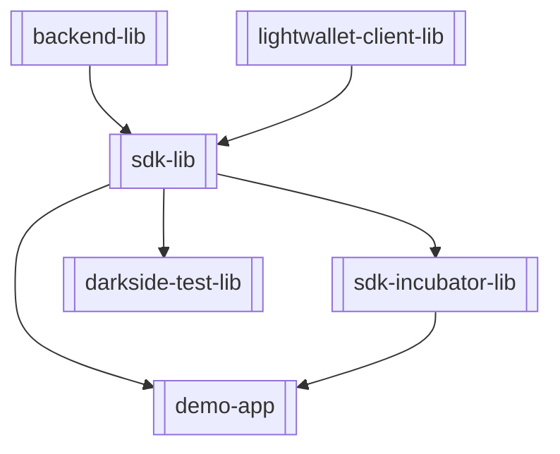

# Overview
From an app developer's perspective, this SDK will encapsulate the most complex aspects of using Zcash, freeing the developer to focus on UI and UX, rather than scanning blockchains and building commitment trees! Internally, the SDK is structured as follows:

Thankfully, the only thing an app developer has to be concerned with is the following:

# Modules
The SDK is broken down into several logical components, implemented as Gradle modules.  At a high level, the modularization is:

 * backend-lib — Native library interfaces.  This is internal to the SDK.
 * sdk-lib — Compiles all of the modules together for the SDK.
 * sdk-incubator-lib — Incubator for new APIs that may eventually be promoted to the SDK.  Classes are packaged to match the SDK, so that moving them will not necessarily change the API.  While SDK clients can use classes in sdk-incubator-lib, they should anticipate a greater amount of public API churn.
 * lightwallet-client-lib — Provides a set of Kotlin APIs for interacting with lightwalletd over the network.
 * darkside-test-lib — Contains integration tests for the SDK, running against a localhost lightwalletd instance running in darkside mode.  This is not run as part of the SDK test suite, because it requires some manual setup to enable.
 * demo-app — Contains a primitive demo application to exercise the SDK.

# Data model
Before diving into some of the module specifics, it is helpful to provide some context on the data model representations as data flows between the different modules of this repository.  There are multiple data representations, including:

1. Primitive — The JNI generally requires primitive values (e.g. `Int`, `Long`, `String`, `ByteArray`).  These are not generally part of the public API.
2. JNI — Objects that may cross the JNI boundary.  These are not generally part of the public API.
3. Network — The wire representation for calls to and from the Lightwalletd server.  These are generated by `protoc` at compile time.  These are not generally a public API.
4. Unsafe — The representation provided as the output from `lightwallet-client-lib`. These values are not necessarily validated, hence the smurf naming with the suffix `Unsafe`. These are not generally a public API for clients of the SDK.
5. SDK — Objects exposed as a public API for clients of the SDK.

# lightwallet-client-lib
This library is a work-in-progress.

This is generally not considered part of the public API, and much of the internals do not guarantee API stability.  Internally, the implementation uses GRPC although over time that should be hidden from clients.

# sdk-lib

## Components

| Component                      | Summary                                                                                   |
|--------------------------------|-------------------------------------------------------------------------------------------|
| **LightWalletClient**          | Component used for requesting compact blocks                                              |
| **CompactBlockStore**          | Stores compact blocks that have been downloaded from the `LightWalletClient`              |
| **CompactBlockProcessor**      | Validates and scans the compact blocks in the `CompactBlockStore` for transaction details |
| **OutboundTransactionManager** | Creates, Submits and manages transactions for spending funds                              |
| **DerivationTool**             | Utilities for deriving keys and addresses                                                 |
| **RustBackend**                | Wraps and simplifies the rust library and exposes its functionality to the Kotlin SDK     |

## Checkpoints
To improve the speed of syncing with the Zcash network, the SDK contains a series of embedded checkpoints.  These should be updated periodically, as new transactions are added to the network.  Checkpoints are stored under the [sdk-lib's assets](../sdk-lib/src/main/assets/co.electriccoin.zcash/checkpoint) directory as JSON files.  Checkpoints for both mainnet and testnet are bundled into the SDK.

To update the checkpoints, see [Checkmate](https://github.com/zcash-hackworks/checkmate).

We generally recommend adding new checkpoints every few weeks.  By convention, checkpoints are added in block 
increments of 2,500 for mainnet and 10,000 for testnet. These increments provide a reasonable tradeoff in terms of number of checkpoints versus performance.

There are two special checkpoints, one for sapling activation and another for orchard activation.  These are 
mentioned because they don't follow the "round 2,500 or 10,000" rule.
 * Sapling activation
     * Mainnet: 419200
     * Testnet: 280000
 * Orchard activation
     * Mainnet: 1687104
     * Testnet: 1842420

Note: If you're updating the checkpoints with the Checkmate tool, it'll generate several checkpoint files from input parameters for you. Mostly you can filter out the first and the last one, as the first is probably already imported in the project and the last one does not follow the round rule.
